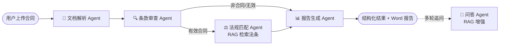

# 合同风险审查 AI Agent（Contract Risk Review Agent）

> 一款基于**多 Agent 编排**与 **RAG（检索增强生成）** 的智能合同审查系统：上传合同即可自动识别风险条款、匹配法律依据、生成 Word 审查报告，并支持基于合同内容的多轮追问。


---

## ✨ 功能特性

- 📄 **多格式解析**：支持 PDF / Word / TXT / 图片（OCR），多文件视为同一份合同合并分析
- 🔍 **风险识别**：基于 LLM 结构化输出，逐条识别风险类型、等级（高/中/低）、依据与修改建议
- ⚖️ **法规匹配（RAG）**：从《民法典》《劳动合同法》向量库中检索相关法条，为每条风险提供法律依据
- 📊 **结构化报告**：一键生成并下载 Word 审查报告
- 💬 **智能追问**：针对已分析合同多轮问答，RAG 增强、有理有据
- 🕓 **历史记录**：前端本地持久化（localStorage），可回看历次分析与对话

---

## 🏗️ 系统架构

采用**编排器（Orchestrator）+ 多 Agent**设计，各 Agent 职责单一、可插拔、故障隔离：



| Agent | 职责 |
|-------|------|
| **文档解析 Agent** | 统一解析 PDF / Word / TXT / 图片，输出纯文本 |
| **条款审查 Agent** | 调用 LLM 结构化输出，识别风险条款 |
| **法规匹配 Agent** | 用 RAG 检索最相关法条，补充法律依据 |
| **报告生成 Agent** | 汇总总体结论、生成 Word 报告 |
| **问答 Agent** | 基于合同 + 检索法条，回答用户追问 |

---

## 🛠️ 技术栈

| 层 | 技术 |
|----|------|
| **后端** | Python · FastAPI · Pydantic · Uvicorn |
| **大模型** | DeepSeek（OpenAI 兼容接口，模型层可插拔） |
| **RAG** | ChromaDB（向量数据库） · sentence-transformers（`BAAI/bge-small-zh-v1.5` 中文向量模型） |
| **文档处理** | PyMuPDF · python-docx · PaddleOCR |
| **前端** | React · TypeScript · Vite · Tailwind CSS · axios |
| **知识库** | 《中华人民共和国民法典》《劳动合同法》（按条切分、向量化） |

---

## 📁 项目结构

```
contract-risk-agent/
├── agents/                 # 各功能 Agent（解析/审查/法规匹配/报告/问答）
├── core/                   # 编排器 orchestrator + 数据模型 model
├── infrastructure/         # 基础设施：LLM 服务、RAG 检索、文档解析
│   ├── llm/                # 大模型服务（可插拔）
│   ├── rag/                # 向量检索
│   └── document/           # 多格式文档解析
├── api/                    # FastAPI 接口层（main.py）
├── frontend/               # React + TS 前端
├── scripts/                # 建库/清洗/爬取脚本
├── data/laws/              # 法规原文、清洗结果、向量库
└── requirements.txt
```

---

## 🚀 快速开始

### 1. 后端

```bash
# 克隆项目
git clone https://github.com/Trop888/contract-risk-agent.git
cd contract-risk-agent

# 创建虚拟环境并安装依赖
python -m venv venv
venv\Scripts\activate          # Windows；macOS/Linux: source venv/bin/activate
pip install -r requirements.txt
```

在根目录新建 `.env` 文件，填入你的 API 密钥：

```env
DEEPSEEK_API_KEY=你的_deepseek_密钥
DEEPSEEK_BASE_URL=https://api.deepseek.com
DEEPSEEK_MODEL=deepseek-chat
```

> 向量库已包含在仓库中，可直接使用；如需重建：`python scripts/build_vectordb.py`

启动后端：

```bash
uvicorn api.main:app --reload --port 8000
```

访问 http://localhost:8000/health 返回 `{"status":"ok"}` 即成功。

### 2. 前端

```bash
cd frontend
npm install
npm run dev
```

浏览器打开 http://localhost:5173 即可使用。

---

## 📡 API 接口

| 方法 | 路径 | 说明 |
|------|------|------|
| GET | `/health` | 健康检查 |
| POST | `/analyze` | 上传合同文件，返回结构化分析结果 |
| POST | `/chat` | 基于合同内容的多轮追问 |
| POST | `/report` | 生成并下载 Word 审查报告 |

---

## 💡 设计亮点

- **多 Agent 职责分离**：解析、审查、法规匹配、报告、问答各司其职，便于扩展与维护
- **模型/向量库可插拔**：LLM 服务抽象为接口，更换模型无需改业务代码
- **RAG 落地**：法规按条切分 + 向量检索，让 AI 的风险判断"有法可依"、减少幻觉
- **前后端分离**：FastAPI 提供 RESTful 接口，React 独立前端，通过 CORS 通信

---

## 📄 声明

本项目为个人学习与技术演示用途，分析结果仅供参考，不构成法律意见。
